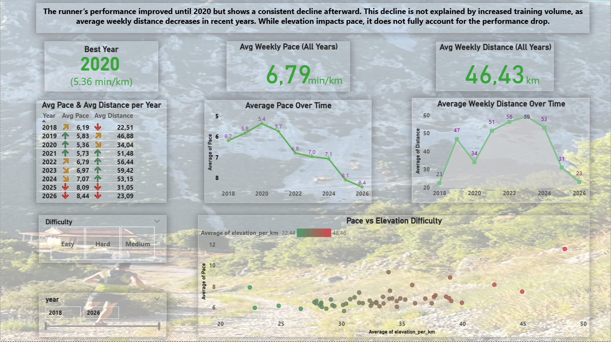

# Running Performance Analysis

## Project Description

This project analyzes a runner’s performance over time using Strava activity data. The goal is to determine whether performance improves or declines and what factors may explain the trend.

## Tools
- Python (data cleaning & analysis)
- MySQL (data storage & querying)
- Power BI (visualization)

## Key Metrics

- Pace (min/km)
- Distance (km)
- Elevation per km (difficulty)

## Key Insights

- Performance improved until 2020, reaching peak performance.
- After 2020, a consistent decline in pace is observed.
- This decline is not explained by increased training volume, as average weekly distance decreases in recent years.
- While elevation affects pace, it does not fully explain the performance drop.

## Dashboard 

The Power BI dashboard visualizes:
- Performance trends over time
- Training load (distance)
- Relationship between pace and difficulty
